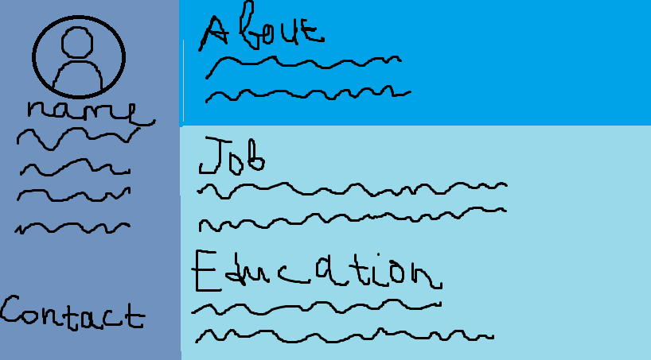

<!DOCTYPE html>
<html lang="en">
<head>
  <meta charset="UTF-8" />
  <meta name="viewport" content="width=device-width, initial-scale=1.0"/>
  <link rel="stylesheet" href="styles.css"/>
</head>
<body>
  <header>
    <h1>Welcome to My Portfolio</h1>
    <nav>
      <a href="#about">About</a>
      <a href="#projects">Projects</a>
      <a href="#contact">Contact</a>
    </nav>
  </header>
  
  <main>
    <section id="about">
      <h2>About Me</h2>
      
Hello! I’m a web developer with a passion for building clean and responsive websites.

    </section>
    <section id="projects">
      <h2>Projects</h2>
      
    </section>
    <section id="contact">
      <h2>Contact Me</h2>
      <form id="contactForm">
        <label for="email">Email:</label>
        <input type="email" id="email" required/>
        <button type="submit">Send</button>
      </form>
    </section>
    <section id="map">
      <h2>Where I'm Based</h2>
      <iframe 
        src="https://www.google.com/maps/embed?pb=!1m18!1m12!1m3!1d3153.019563184248!2d-122.4194154846788!3d37.77492977975995!2m3!1f0!2f0!3f0!3m2!1i1024!2i768!4f13.1!3m3!1m2!1s0x80858064caeaf6ed%3A0x26e7518ae40973fc!2sSan+Francisco!5e0!3m2!1sen!2sus!4v1618383074710!5m2!1sen!2sus"
        width="100%" height="300" style="border:0;" allowfullscreen="" loading="lazy">
      </iframe>
    </section>
  </main>

  <footer>
    
© 2025 My Portfolio

  </footer>

  
</body>
</html>
